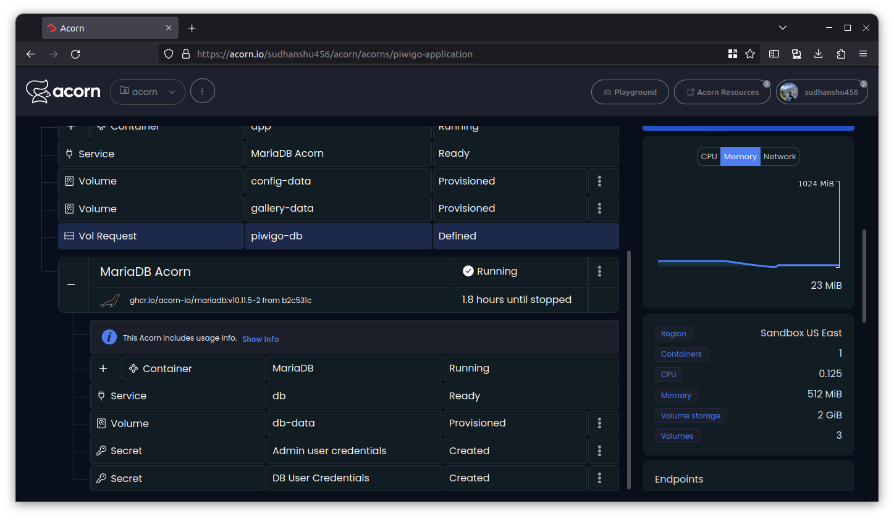

# Building Your Online Gallery using Piwigo on Acron

Photographs have always held a special place in our hearts, serving as portals to the past, brimming with vibrant colors. With the constant influx of new photos, have you ever felt overwhelmed trying to organize them? Or perhaps you've considered creating an online gallery but were intimidated by the technical complexities? You're not alone. This is where Piwigo, an open-source Digital Asset Manager (DAM), becomes invaluable. It acts as a digital librarian, bringing order to your digital collection, whether it’s family photos, professional portfolios, or a diverse range of logos and documents, all accessible through a sleek web interface.

Understanding the potential of Piwigo is one thing, but implementing it can be daunting, often involving complex deployment configurations and overwhelming technicalities. This is where Acorn steps in to offer a solution. Acorn is an app platform designed to simplify the building, sharing, and deploying of containerized apps. It allows you to encapsulate your entire application, along with its dependencies, into a single file known as an Acornfile. With Acorn, packaging your application into an OCI container image and deploying it becomes straightforward, often requiring just a single click. Let’s explore Acorn in detail before delving into how to run Piwigo with it.

[Acorn Cloud Platform](https://beta.acorn.io/) lets you run your acorns in free [sandbox environment](https://docs.acorn.io/sandbox). You can also share nifty artifact with a link, making it a breeze for you to deploy with just a single click into your very own sandbox environment. You can run your Acorns as often as you like for upto 2hrs to evaluate and experiment your application. If you wish to [run your Production workloads](https://docs.acorn.io/aws/overview), upgrade to a teams and enterprise plan to deploy and manage applications in your AWS account.

If you are looking to get started on the Acorn Platform and give the Piwigo application a whirl, just hit that link below and have a peek!

[](https://beta.acorn.io/run/ghcr.io/infracloudio/piwigo-acorn:v13.8.0-0?ref=aashimodi14&name=piwigo-sample-app)

To learn how to write your own Acornfile to deploy Piwigo or further customise, follow along:

> _Note: Everything shown in this tutorial can be found in [this repository](https://github.com/infracloudio/piwigo-acorn)._

## Pre-requisites

- [Acorn CLI](https://docs.acorn.io/installation/installing)
- Github account to sign up for the Acorn Platform.

## Acorn Login

Login to the [Acorn Platform](http://beta.acorn.io) using the Github Sign-In option with your Github user.


After the installation of Acorn CLI for your OS, you can login to the Acorn platform.

```
acorn login beta.acorn.io
```

## Deploy your Piwigo application

We will be deploying a sample photo gallery application which enables users to organise, manage and share their digital assets such as images, videos, logos and documents on a website. You can find the source code for the Acorn of this sample application [here](https://github.com/infracloudio/piwigo-acorn).

There are two ways you can try this sample application.

- Using Acorn platform dashboard.
- Using CLI

The first way is the easiest one where, in just a few clicks you can deploy the Piwigo application to the platform and start using it. However, if you want to customize the application or want to understand how you can run your own Flask applications using Acorn, use the second option.

## Running Piwigo application using Dashboard

We can run our application from an existing image from the Acorn Cloud Platform UI by clicking on the _”Create Acorns”_ button.

Choose the source for deploying your Acorns


On the “Create Acorns” page, provide a name such as piwigo-sample-app and keeping Project's default Region, type in the below Pre-built Acorn image or your own Acorn Image and choose Create.

```
ghcr.io/infracloudio/piwigo-acorn:v13.8.0-0
```


Now the sample App is provisioned on Acorn Cloud Platform and is available for 2 hrs. Upgrade to Enterprise account to keep it running longer.


Once the Acorn is running, you can access it by clicking the Endpoint or the redirect link.


## Running the Piwigo Application using acorn CLI

As mentioned previously, running the acorn application using CLI lets you understand Acorn and the Acornfile. You can also customize the Piwigo app to your requirement or use your Acorn knowledge to run your own Piwigo application.

To run the Piwigo app using CLI, let’s start by cloning its source repository.

```sh
git clone https://github.com/infracloudio/piwigo-acorn.git
```

Here’s the folder structure overview for the sample app.

```sh
.
├── Acornfile
├── img
├── LICENSE
├── piwigo_icon.webp
├── README.md
└── tutorial.md

1 directory, 5 files
```

### Acornfile

This is where all the Acorn configuration lives. The Acornfile describes the containers, arguments, secrets and volumes to deploy the application. During the Acorn build all of the Docker containers will be built or pulled from a registry and packaged into the Acorn image.

```bash

name:        "Piwigo Sample Acorn"
description: "Acorn running a sample Piwigo app"
readme:      "./README.md"
icon:        "./piwigo_icon.webp"

services: db: {
  image: "ghcr.io/acorn-io/mariadb:v10.#.#-#" // pulls the latest 10.x.x version
  serviceArgs: {
    dbName: args.dbName
    username: args.user
  }
}

args: {
  // Name of the database to create. Defaults to "instance"
  dbName: "piwigo"
  // Provide user for mysql. If the value is not provided, it will default to
  user: "piwigo"
}

containers: {
  app: {
    image: "ghcr.io/linuxserver/piwigo:13.8.0"
    env: {
      "PUID": "1000"
      "PGID": "1000"
      "TZ": "Etc/UTC"
    }
    consumes: ["db"]
    ports: publish: "80/http"
    dirs: {
      "/config": "volume://config-data"
      "/gallery": "volume://gallery-data"
    }
  }
}

volumes: {
  "config-data": {}
  "gallery-data": {}
  "piwigo-db": {}
}
```

### Deploy your Application

We will now deploy our application to the Acorn Platform. The following command will build and run the Acorn on the hosted platform in a single step. Since we’ve already logged in to the platform in the previous step, this command will talk to the platform to build and deploy your application. For production deployments you will want to build the image and push it to a registry.

From the same folder as your Acornfile, run :

```sh
acorn run -n piwigo-application
```

Once the application is running successfully, it will output a URL for the application endpoint.


## Using the application

Once you follow one of the above methods of deploying the Piwigo, you’ll get a endpoint in the Acorn dashboard or in the CLI output, that will help you reach to your application in browser.

For this sample deployment the endpoint url is `https://piwigo-application-80517a74.ccx3c8.on-acorn.io/`

Before you began using the Piwigo, it requires one time installation, which will happen once you open the provided endpoint, it should automatically redirect to installation page.


### Database Configuration

If you're wondering where would you get the database configuration values to fill in, we have to look into config within Acornfile, some values from Acorn Dashboard.

To complete the installation, these values are needed for database configuration.

- host: `db`
- user: `piwigo`
- db_name: `piwigo`
- password: The password can be revealed from the Acorn Cloud Applications Page as follows --
  - Expand the Application section > Expand MariaDB Acorn service > Select "Show resources" > Select secret (DB user credentials) > Reveal Value of the password


> Note: user and db_name are configurable and can be provided as arguments while running the Acornfile. You can configure them as part of the "Advanced Configurations" of your Acorn.

### Administrator Configuration

Now, setup your administrator configs by providing a username, email and login password to Piwigo Dashboard.


Once the installation is completed it should lead you to Piwigo Dashboard page.


This is it, now you can upload the photos you want in Piwigo Application.

## Acorn Dashboard

The Acorn Dashboard is integrated with multiple features such as Events, Logs, Details and accessing the Shell of the Application. Details include the CPU, Memory, Network, and Errors for the Application.



> Explore various available options by clicking the Menu option on your Acorn App and to access the Acorn Dashboard head to [Acorn.io](https://www.acorn.io/) and login with your credentials.

## Development Mode

In development mode, Acorn will watch the local directory for changes and synchronize them to the running Acorn app. In general, changes to the Acornfile are directly synchronized, e.g. adding environment variables, etc. Depending on the change, the deployed containers will be recreated.

If you've defined a line `if args.dev { dirs: "/app": "./" }` in the Acornfile, it will enable hot-reloading of code by mounting the current local directory into the app container.

You will see the change applied when you reload the application's page in your browser, in case of Piwigo, we don't have any application code, except Acornfile, which will be by default on watch if you run dev mode.

## How to Build and Push an artifact to a registry

Once you're done with the changes, and application is working as expected, you can proceed to build and packaging to a registry, later the acorn image can be used directly in the Acorn platform using the dashboard, as described earlier in running the application using Dashboard.

To understand how this works, let assume you want to push it to GCR(GitHub Container Registry).

### Log in to the registry

Before building and you need to login to the desired container registry you wish to push. In below example we're logging into GitHub Container Registry.

```sh
acorn login ghcr.io
```

### Build and push the image

After, login you can build, tag and push the image using the below command.

```sh
acorn build -t ghcr.io/infracloudio/piwigo-acorn:v0.0.0.1 --push
```

## What's Next?

1. Any app provisioned under Acorn sandbox region is available for only 2hrs, in order to keep it running longer you need to upgrade to Pro account.
2. After deploying you can edit the Acorn Application or remove it if no longer needed. Click the Edit option to edit your Acorn's Image. Toggle the Advanced Options switch for additional edit options.
3. Remove the Acorn by selecting the Remove option from your Acorn dashboard.

## Conclusion

In this tutorial, we have learned how to deploy a Piwigo application on Acorn Platform by defining cloud services information into an Acornfile. Then we explored the Acorn Platform Dashboard to gain useful insights of deployed application.

Lastly, we saw an example to build and push changes to registry, which later can be directly used in Acorn Platform.
